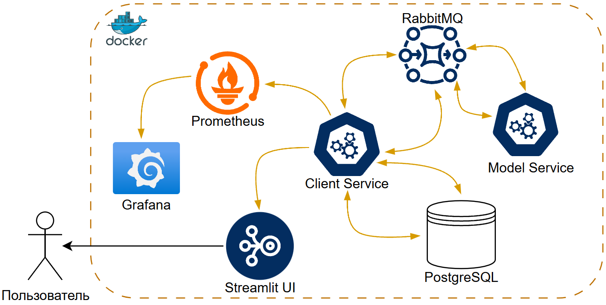

# 🎓 Финальный проект по курсу «ML-сервисы на Python»  

**Автор:** Юрпалов Сергей  

  

## 🚀 О проекте

Сервис для предсказания «спам» vs «ham» с использованием трёх разных моделей:

- Linear Regression
- Naive Bayes
- Gradient Boosting (scikit-learn)

Архитектура построена на микросервисах — модели можно разворачивать на мощных машинах.

## 📱 Внешний вид

  

  

## 🔑 Ключевые возможности

- Авторизация через cookies с хранением сессии 🔒  
- Микросервисы для отделения клиентской части от моделей 🛠️  
- Асинхронное взаимодействие с PostgreSQL через asyncpg 🗄️✨  
- Интегрированная система мониторинга: Prometheus + Grafana 📊  

## 🏗️ Сервисы

- **client-service**  
  - API для аутентификации и маршрутизации запросов  
  - ENV: `DATABASE_URL`, `MESSAGE_BROKER_HOST_URL`  
- **model-service**  
  - Получает сообщения из очереди, прогоняет через 3 модели (Logistic, SVM, Neural)  
  - ENV: `DATABASE_URL`, `MESSAGE_BROKER_HOST_URL`  
- **frontend**  
  - Streamlit UI, подключается к `http://client-service:8000`  
- **rabbitmq** 🐇  
  - Очередь сообщений для безопасного обмена между сервисами  
- **postgres** 🐘  
  - Асинхронная БД для пользователей, сессий и логов  
- **prometheus** & **grafana** 📈  
  - Сбор и визуализация метрик по работе сервисов  

## 📈 Мониторинг

Построен **dashboard** в Grafana с базовыми метриками сервиса.

  

---

## 🐳 Быстрый старт  

> 1. `git clone https://github.com/wilfordaf/itmo-ml-service/`  
> 2. `cd itmo-ml-service && docker-compose up --build`
